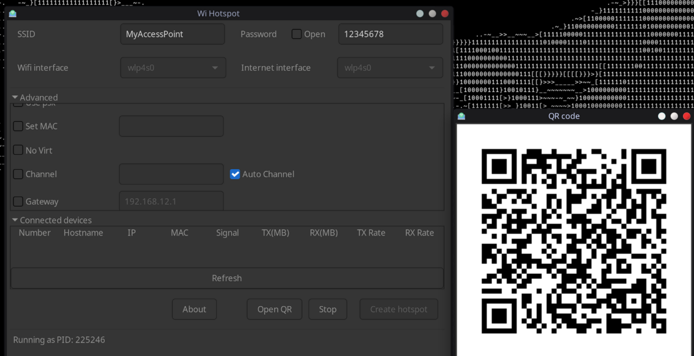
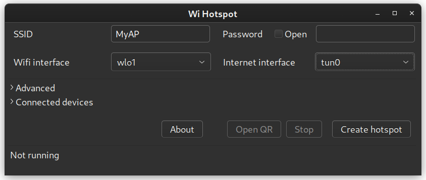

## Linux Wifi Hotspot
#### Edited by Big Pickle OpenCode
### What's new
* Use aa-complain instead of complain to fix the permission issue for dnsmasq
* Fix some 5Ghz band not working issue
* Compatible with iw 6.7

#### Project Update

Hi everyone — I've been inactive on this project for a while due to other commitments. I'm now actively looking for contributors and maintainers to help keep the project alive and growing.

If you're interested in contributing — whether it's fixing bugs, improving documentation, or developing new features — please open an issue to introduce yourself.

I'm also open to adding trusted collaborators with commit access who demonstrate consistent contributions and interest.

Thanks for being part of the community and keeping Linux-WiFi-Hotspot going!

### Features

* Share your wifi like in Windows - Use wifi and enable hotspot at the same time.
* Share a wifi access point from any network interface
* [Create a hotspot with VPN](#vpn-hotspot) - The hotspot has the traffic tunnelled through VPN. Useful for devices with no VPN app support like TV or gaming consoles.
* Share wifi via QR code
* MAC filter
* View connected devices
* Includes Both command line and GUI.
* Support both 2.4GHz and 5GHz (Need to be compatible with your wifi adapter). Ex: You have connected to the 5GHz network and share a connection with 2.4GHz.
* Customise wifi Channel, Change MAC address, etc.
* Hide SSID
* customize gateway IP address
* Enable IEEE 80211n, IEEE 80211ac and IEEE 80211ax modes
#### Updates
* Auto channel selection 




### Notes

- Sometimes there are troubles with **5Ghz bands** due to some vendor restrictions. If you cannot start the hotspot while you are connected to the 5Ghz band, Unselect **Auto** and select **2.4Ghz** in frequency selection.

- If any problems with **RealTeK Wifi Adapters** see [this](docs/howto/realtek.md)

- **Unable to allocate IP: firewalld issue:** Please check for potential fixes: [#209](https://github.com/lakinduakash/linux-wifi-hotspot/issues/209) [#166](https://github.com/lakinduakash/linux-wifi-hotspot/issues/166)

## Installation
## Dependencies

#### General
* bash
* util-linux (for getopt)
* procps or procps-ng
* hostapd
* iproute2
* iw
* iwconfig (you only need this if 'iw' can not recognize your adapter)
* haveged (optional)

_Make sure you have those dependencies by typing them in terminal. If any of dependencies fail
install it using your distro's package manager_

#### For 'NATed' or 'None' Internet sharing method
* dnsmasq
* iptables

#### To build from source

* make
* gcc and g++
* build-essential
* pkg-config
* gtk
* libgtk-3-dev
* libqrencode-dev (for qr code generation)
* libpng-dev (for qr code generation)

On Ubuntu or Debian install dependencies by,

```bash
sudo apt install -y libgtk-3-dev build-essential gcc g++ pkg-config make hostapd libqrencode-dev libpng-dev
```

On Fedora/CentOS/Red Hat Enterprise Linux/Rocky Linux/Oracle Linux
```bash
sudo dnf install -y gtk3-devel gcc gcc-c++ kernel-devel pkg-config make hostapd qrencode-devel libpng-devel
```

## Installation

    git clone https://github.com/lolsoundsus/linux-wifi-hotspot-vibe-edited
    cd linux-wifi-hotspot-vibe-edited

    #build binaries
    make

    #install
    sudo make install

## Uninstallation
    sudo make uninstall

## Running
You can launch the GUI by searching for "Wifi Hotspot" in the Application Menu
or using the terminal with:

    wihotspot

<h2 id="vpn-hotspot">Create VPN Hotspot</h2>

After connecting to VPN, Open `wihotspot` GUI. Select the virtual interface created by the VPN. In this case it is `tun0`




## License
FreeBSD

Copyright (c) 2013, oblique

Copyright (c) 2024, lakinduakash


[](https://app.fossa.com/projects/git%2Bgithub.com%2Flakinduakash%2Flinux-wifi-hotspot?ref=badge_large)
